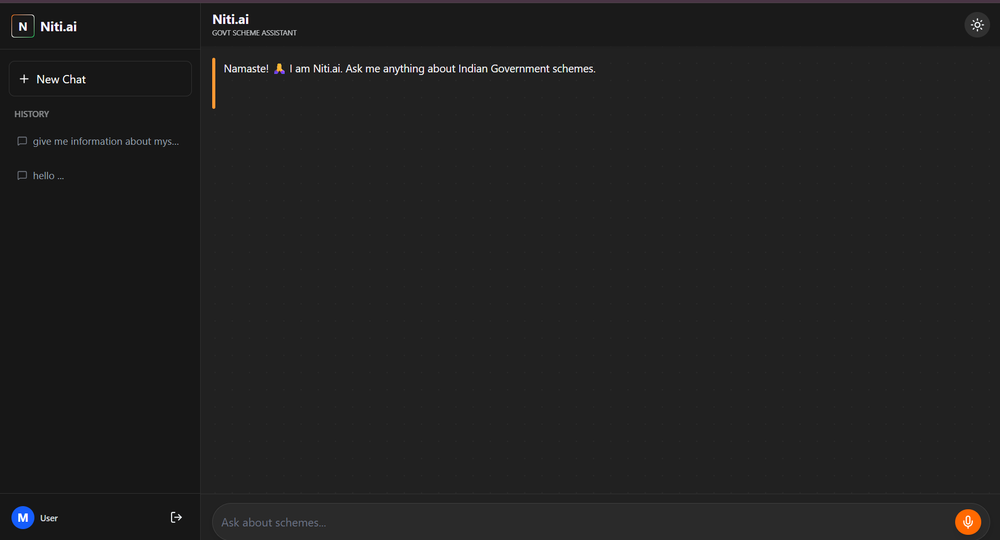

# 🇮🇳 Niti.ai - Your Personal Government Scheme Assistant

**Niti.ai** is an AI-powered platform designed to bridge the gap between Indian citizens and Government schemes. It simplifies complex scheme details into easy-to-understand language, overcoming literacy and language barriers.

 

##  Key Features

* ** Voice-First Interaction:** Citizens can simply speak to ask about schemes (Text-to-Speech & Speech-to-Text).
* ** Intelligent Search:** Uses Vector Search (RAG) to find the exact scheme from a database of 100+ schemes.
* **🇮🇳 Multilingual Support:** Understands Hinglish and replies in the user's preferred language style.
* ** Secure Auth & History:** Google Login via Supabase saves chat history and user sessions permanently.
* ** Real-time Streaming:** Typewriter effect for a natural, conversational AI experience.

## Tech Stack

* **Frontend:** Next.js 15 (App Router), Tailwind CSS, Framer Motion, Lucide React.
* **Backend:** Python (Flask/FastAPI), LangChain, Google Gemini Pro (LLM).
* **Database & Auth:** Supabase (PostgreSQL + Vector Store).
* **Deployment:** Vercel (Frontend) + Render (Backend).

## How to Run Locally

1.  **Clone the repo:**
    ```bash
    git clone [https://github.com/manavmerja/niti-ai.git](https://github.com/manavmerja/niti-ai.git)
    ```
2.  **Frontend Setup:**
    ```bash
    cd frontend
    npm install
    npm run dev
    ```
3.  **Backend Setup:**
    ```bash
    cd backend
    pip install -r requirements.txt
    python app.py
    ```

## Future Scope
* **WhatsApp Integration:** To reach rural users directly on their phones.
* **Document Locker:** Integrating DigiLocker to auto-verify eligibility.
* **Application Autofill:** AI Agent that fills the scheme form for the user.

